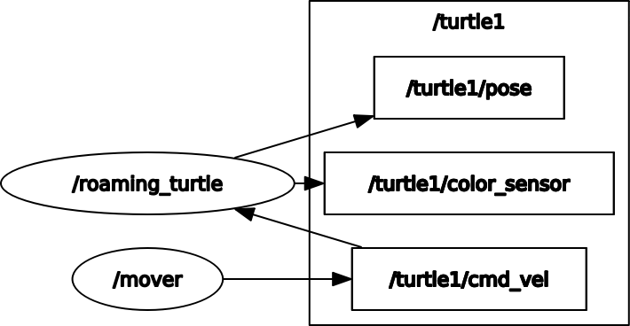

# CRAZY TURTLE
Demonstration package for ME495.
This README is intentionally vague.
Figuring out how this package works and filling in the details is part of the
exercise. Fill in the blanks between `<angle brackets>` with your answer.
Unless otherwise specified, list the command and all arguments that you passed to it.

## Setup Instructions
1. Compile the workspace by executing `catkin_make`
2. Initialize the ROS environment by exectuing `. devel/setup.bash`
3. Run the launchfile `src/crazy_turtle/launch/go_crazy_turtle.launch` by executing `roslaunch crazy_turtle go_crazy_turtle.launch`
4. When running you can see a visual depiction of the ROS graph using the `rqt_graph` command.
   The ROS graph, including all topics and node labels, looks like:
   

## Runtime Information
5. Use the ROS command `rosnode list` to list all the nodes that are running.
   The output of the command looks like
   ```
   /mover
   /roaming_turtle
   /rosout
   ```

6. Use the ROS command `rostopic list` to list the topics
   The output of the command looks like
   ```
   /rosout
   /rosout_agg
   /statistics
   /turtle1/cmd_vel
   /turtle1/color_sensor
   /turtle1/pose
   ```

7. Use the ROS command `rostopic hz /turtle1/cmd_vel` to verify that the frequency of
   the `/turtle1/cmd_vel` topic is `100 Hz`

8. Use the ROS command `rosservice list` to list the services.
   The output of the command looks like
   ```
   /clear
   /kill
   /mover/get_loggers
   /mover/set_logger_level
   /reset
   /roaming_turtle/get_loggers
   /roaming_turtle/set_logger_level
   /rosout/get_loggers
   /rosout/set_logger_level
   /rqt_gui_py_node_66331/get_loggers
   /rqt_gui_py_node_66331/set_logger_level
   /spawn
   /switch
   /turtle1/set_pen
   /turtle1/teleport_absolute
   /turtle1/teleport_relative
   ```

9. Use the ROS command `rosservice info /switch` to view information about the `/switch` service.
   The type of the `/switch` service is `crazy_turtle/Switch` and it is offered by
   the `/mover` node.

10.Use the ROS command `rosparam list` to list the parameters that are loaded
   into the parameter server.
   The output of the command looks like
   ```
   /mover/velocity
   /roaming_turtle/background_b
   /roaming_turtle/background_g
   /roaming_turtle/background_r
   /rosdistro
   /roslaunch/uris/host_ctsaitsao_xps_15_9550__39305
   /roslaunch/uris/host_ctsaitsao_xps_15_9550__39421
   /roslaunch/uris/host_ctsaitsao_xps_15_9550__40791
   /roslaunch/uris/host_ctsaitsao_xps_15_9550__41027
   /rosversion
   /run_id
   ```

## Package and Dependencies
11. Use the ROS command `rospack depends crazy_turtle` to list the immediate (direct) dependencies of `crazy_turtle`
   The output of the command looks like
   ```
   catkin
   genmsg
   genpy
   cpp_common
   rostime
   roscpp_traits
   roscpp_serialization
   message_runtime
   gencpp
   geneus
   gennodejs
   genlisp
   message_generation
   rosbuild
   rosconsole
   std_msgs
   rosgraph_msgs
   xmlrpcpp
   roscpp
   rosgraph
   ros_environment
   rospack
   roslib
   rospy
   geometry_msgs
   std_srvs
   turtlesim
   ```
   [these are all the n-th order dependencies. you are looking for `rospcak depends1 crazy_turtle`]
12. Use the ROS command `rossrv package crazy_turtle` to list the types of services defined by `crazy_turtle`
    The output of the command looks like
    ```
    crazy_turtle/Switch
    ```

## Live Interaction
13. Use the ROS command `rosservice call /switch [1,1,1,1,1]` to call the `/switch` service.
    The command returns
    ```
    x: 1.0
    y: 1.0
    ```
    and the turtle teleports itself to the position (x=1, y=1, theta=1) at a starting linear velocity of 1 and a starting angular velocity of 1.
    (Hint: use `rossrv info` on the type of the `/switch` service to see the parameters.
     To test the behavior, look at the code or try calling with `x = 1`, `y = 1`, once with `linear_velocity = 0` and `angular_velocity = 0` and once with these at different nonzero values.)
14. What is the value of the `/mover/velocity` parameter? 5
15. What happens to the turtle if you change `/mover/velocity` to 10? Nothing.
16. Use the ROS command `rosnode kill mover` to kill the `/mover` node.
17. Use the ROS command `rosrun crazy_turtle mover cmd_vel:=/turtle1/cmd_vel` to start the `/mover` node. Be sure to
    remap `cmd_vel` to `/turtle1/cmd_vel`.
18. What happened to the turtle's velocity after relaunching `mover`? Faster
